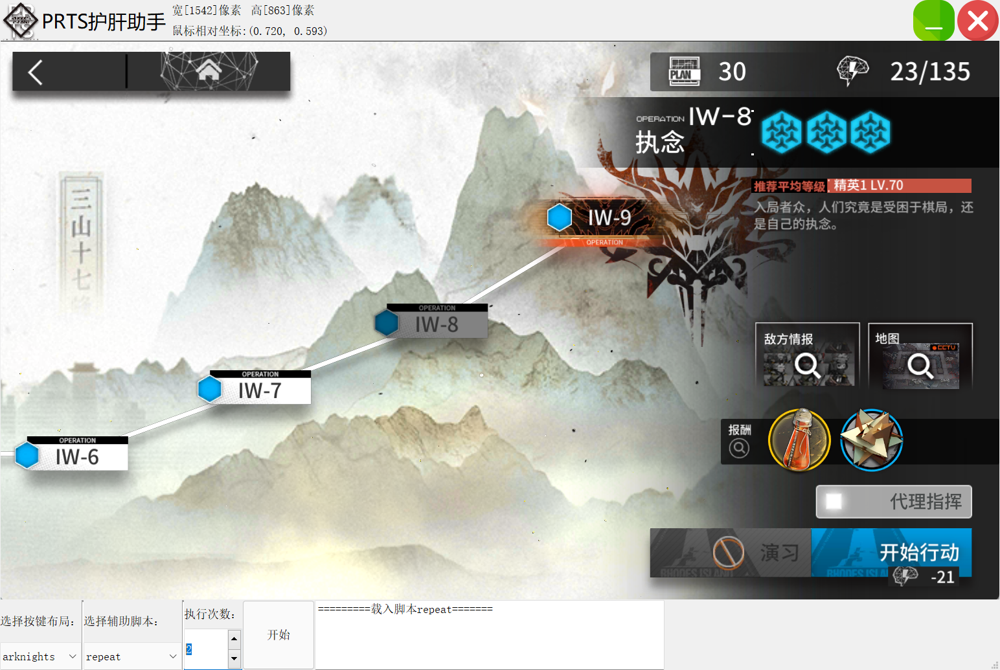

# ArknightsSimulatorHelper.exe
Arknights Simulator Helper | 基于python鼠标控制的明日方舟模拟器护肝助手



**当然也可以用来刷别的东西，他就是个按键精灵**

如果你想实现后台控制(使用ADB接口)而不是前台控制鼠标，并且想使用更多自动化功能，请参考这些项目：

* [Arknights Auto Helper](https://github.com/ninthDevilHAUNSTER/ArknightsAutoHelper)
* [arknights-mower](https://github.com/Konano/arknights-mower)
* [总结列表-明日方舟速通](https://github.com/tkkcc/arknights#%E5%AF%B9%E6%AF%94)


## 1. 特性

* 采用相对坐标，兼容各类模拟器    
    目前已经支持任意分辨率，但还是建议将模拟器分辨率设置为1600x900或近似大小
* 控制鼠标进行挂机操作(运行时占用鼠标，适合闲置电脑挂机，**也是重大缺点**)
* 无需安装安卓ADB工具和Python各种包，exe文件点开即用
* 脚本操作与程序分离，将脚本文件拷到Scripts文件夹内即可运行
* 支持设置按键映射，方便操作win11安卓子系统WSA(**开发中**)

## 2. Todo
* [x] 界面制作
* [x] 相对坐标坐标系计算
* [x] 图片匹配
* [x] 支持任意分辨率(缩放模板图片到当前分辨率大小)
* [x] 多样性脚本开发
* [ ] 脚本任务列表
* [ ] 加载脚本时，显示脚本readme.md文件
* [ ] 支持按键映射(针对win11的安卓子系统WSA而开发，其他模拟器应该都有这个功能)

## 3. 脚本说明
脚本采用以.ark为后缀的文件夹，里面包含img文件夹，run脚本+说明文件组成。img文件夹存放该脚本需要用到的截图，
如开始，返回等按钮的截图等（需要在1600*900模拟器分辨率下截图）

脚本示例(见Scripts文件夹)：`repeat.ark`  
```
|- img/*       # 放置脚本点击图片的地方
|- readme.md   # 写脚本说明的地方(可选)
|- run.ash     # 脚本代码
|- .cache      # 运行时的缓存文件，分享发布时可以删掉
```


`run.ash`文件采用python语法：
```python
template_screen_size(1600, 900)
set_skip_img('network_err1.png')
click('st1_blue.png | st1_pink.png')
click('st2.png')
click('mission_accomplish.png', frequency=7)
```

## 4. 函数说明

* `template_screen_size(height, width)`: 必填项，制作模板的时候，屏幕截图时模拟器的分辨率

  e.g. `template_screen_size(1600, 900)`, 说明当前模板里面的图片，是在1600x900的分辨率上制作的

* `set_skip_img(img_name, click_pos)`: 如果屏幕上出现了给定的图片，则点击屏幕跳过即可，不影响后续操作

  **输入**
    
  * `img_name`: string, 使用` | `表示“或”逻辑  
  * `click_pos`: tuple 坐标`(0.5, 0.5)`或 string 图片名`ok_red.png`
    
  **输出**
    
  * `None`

  ---

  **例子**

  如果遇到了这种：
  
  
  
  这样的提示，则点击屏幕一次，默认`click_pos=(0.5, 0.5)`即图片中心

  当然也可以指定点什么位置，如遇到这样的提示：`set_skip_img('network_err2.png', 'ok_red.png')`

  

  那么可以让他点下面这张图片`ok_red.png`的位置，来实现自动点击确认按钮，而不是图片中间
  
  |


* `set_stop_img(img_name, click_pos)`:如果出现了如下的图片，如网络错误，需要退出重新登陆的，中断当前的脚本
   
   参数同上

   ---

   **例子**

   遇到这样的提示：

   


   只能点黑色的确认按钮`ok_black.png`，然后重新登陆了，所以需要中断当前脚本

   

* `click(img_name, frequency)`:点击图片，中间用` | `分隔开为只要存在两张之一，就点击，以前面的图片优先

    **输入**
    
    * `img_name`: string, 使用` | `表示“或”逻辑  
    * `frequency`: int, 再次寻找等待时间，单位为秒
    
    **输出**  
    
    * `None`

    ---

    **例子**

    e.g. `click('st1_blue.png | st1_pink.png')`

    |蓝色的开始按钮|粉色的开始按钮|
    |---|---|
    |||

    frequency参数为没找到的情况下，再次寻找的等待时间，默认2s
    
    **这个函数会让脚本一直循环这一步，直到找到图片为止**

    非常适合于，挂机3分钟推图时，设置个`click('mission_accomplish.png', frequency=7)`，那么就会每隔7秒查看一下是否刷完了出现任务完成的图片：

    

    如果出现了，那么就点击这个图片，进入下一行语句

* `click_if_exist(img_name, frequency)`: 同上，但只会检测一次，检测不到则跳过进行下一步

* `click_pos(x, y, sleep_time=0)`  

    **输入**
    
    * `x`: float, 相对横坐标[0, 1]
    * `y`: float, 相对纵坐标[0, 1]
    * `sleep_time`: int, 等待x秒后,点击相对位置
    
    **输出**  
    
    * `None`

* `img_exist(img_name)`

    **输入**
    
    * `img_name`: string, 使用` | `表示“或”逻辑  
    
    **输出**
    
    * `boolean`: True->再界面上存在; False->界面上不存在


* Python的关键词

    `if...else...`

    尽量使用上面的关键词进行脚本编写

## 4. 软件开发相关

**待补充**

### 4.3 运行
保证先用**管理员模式**运行命令行：

```cmd
C:\...\ArknightsLiverHelper.exe>conda activate xxxx
（xxxx）C:\...\ArknightsLiverHelper.exe>python app.py
```


### 4.4 打包
Pyqt5 == 5.12.1保证打包成功

> https://github.com/pyinstaller/pyinstaller/issues/4293
